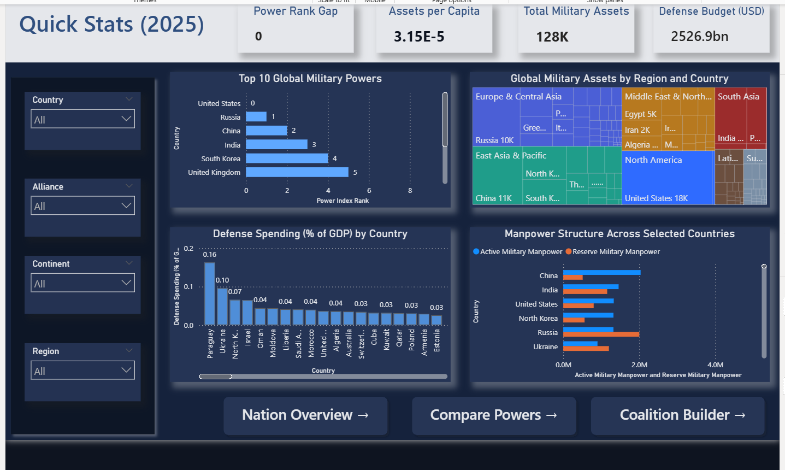
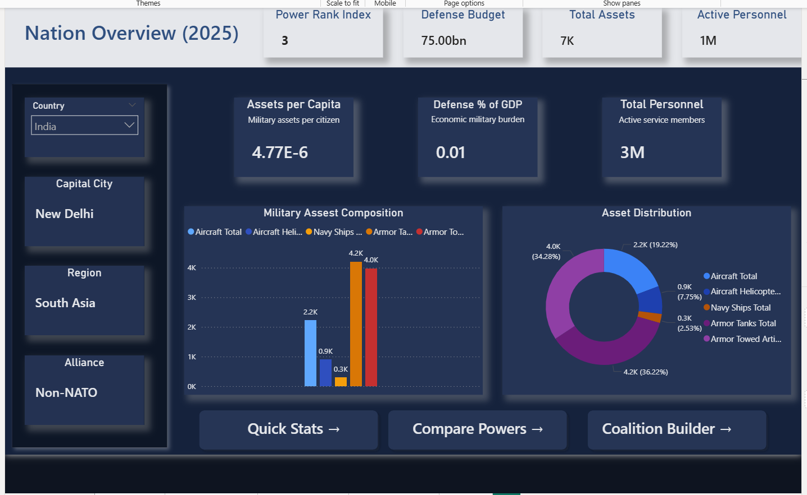
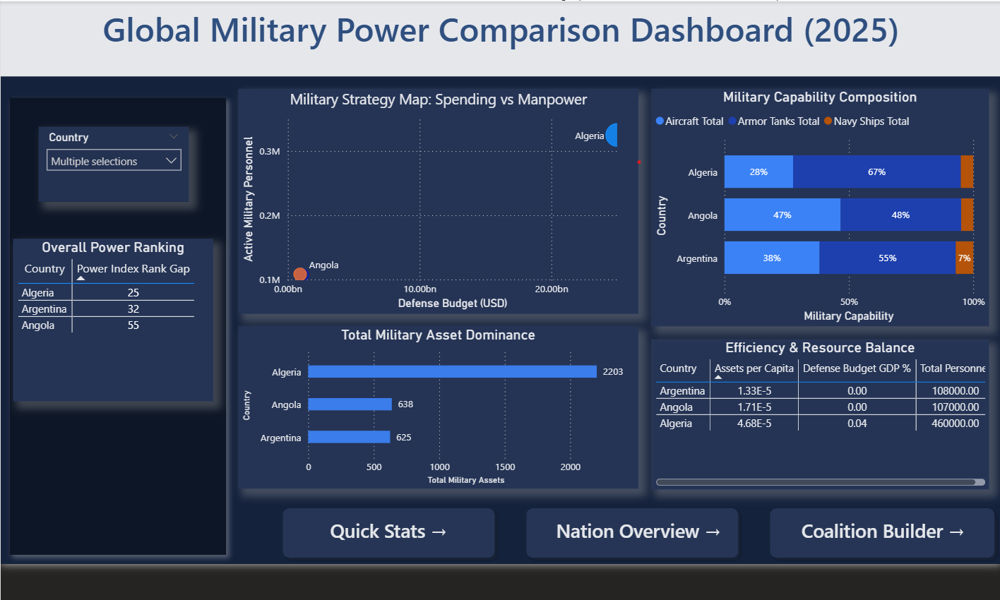
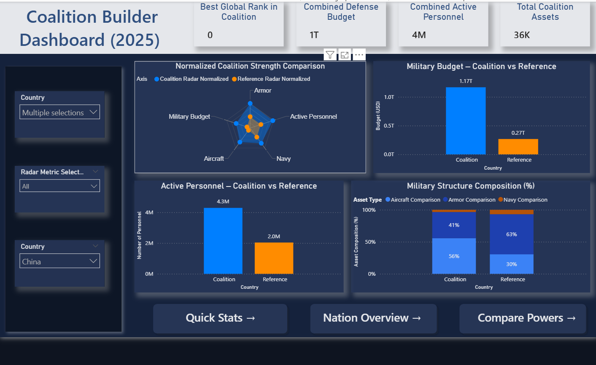

# 🛡️ Military Analytics Dashboard (2025)

  
  
  
  
  

---

  <b>A Unified Military Intelligence & Coalition Analytics System</b> 
  Built using Python, DAX & Power BI

---

# 📌 Project Overview

The **Military Analytics Dashboard (2025)** is a full-scale Business Intelligence project developed during the **Infosys Springboard Virtual Internship 6.0**.

This system consolidates fragmented global military data into a centralized analytics engine capable of:

* 🌍 Country-to-country comparison
* 📊 Efficiency-based KPI analysis
* 🛡 Defense spending evaluation
* 🤝 Coalition-based strength modeling
* ⚡ Dynamic DAX-driven insights

From raw web data to interactive strategic analytics — this project demonstrates complete end-to-end BI engineering.

---

# 🎯 Problem Statement

Military strength data available on public platforms is:

* Fragmented across multiple metric pages
* Not centralized into a unified dataset
* Lacking advanced efficiency-based KPIs
* Missing coalition comparison logic
* Not dynamically interactive

There is no analytical framework that transforms raw military statistics into structured, comparative intelligence insights.

This project solves that problem.

---

# 🚀 Key Features

## 🔹 Automated Data Pipeline

* Python-based web scraping
* Multi-metric extraction
* Regex numeric cleaning
* 145 countries | 75+ features

## 🔹 Advanced KPI Engineering

* Assets per Capita
* Defense Budget to GDP Ratio
* Personnel Density
* Defense Budget per Soldier
* Air Power Ratio
* Armor Intensity Index
* Naval Strength per Coastline
* Military Burden Index
* Power Rank Gap
* Coalition Strength Index (Dynamic KPI)

## 🔹 Coalition Builder Engine

* Multi-country selection
* SUM-based strength aggregation
* DAX-powered recalculation
* Virtual filtering via TREATAS()

## 🔹 Virtual Relationship Architecture

* Disconnected slicers
* No physical table relationships
* Flexible DAX logic
* Dynamic dashboard recalculation

---

# 🛠 Tech Stack

| Layer             | Technology                        |
| ----------------- | --------------------------------- |
| Data Source       | Global Firepower                  |
| Data Extraction   | Python                            |
| Parsing           | BeautifulSoup                     |
| Data Processing   | Pandas                            |
| Data Storage      | CSV                               |
| BI Tool           | Power BI                          |
| Analytics Engine  | DAX                               |
| Modeling Strategy | Virtual Relationship Architecture |

---

# 📊 Dashboard Preview

---

## 🟡 Quick Stats

  

Provides:

* Global overview metrics
* Rank indicators
* High-level strategic insights

---

## 🔵 Nation Overview

  

Displays:

* Personnel & asset breakdown
* Budget analytics
* Efficiency KPIs
* Geographic strength indicators

---

## 🟢 Compare Powers

  

Enables:

* Side-by-side comparison
* Radar visualization
* Rank gap analysis
* Performance contrast

---

## 🔴 Coalition Builder

  

Allows:

* Multi-country selection
* Dynamic aggregation
* Combined strength evaluation
* Strategic alliance modeling

---

# 📈 Results & Insights

This dashboard enables identification of:

* Military efficiency leaders
* Budget-to-performance disparities
* Asset concentration advantages
* Defense burden per citizen
* Coalition impact on global ranking

### Key Observations:

* Larger defense budgets do not always translate to higher efficiency.
* Smaller nations can demonstrate higher asset density.
* Coalition aggregation dramatically shifts comparative strength positions.
* Defense spending per soldier varies significantly across regions.

---

# 🧠 Architecture Overview

This project follows a:

## ⚙ DAX-Driven Virtual Relationship Model

* Disconnected slicers
* TREATAS() filtering logic
* SUM-based dynamic aggregation
* No physical relationships
* Fully recalculating KPI engine

This architecture allows flexible comparison without rigid schema dependencies.

---

# ⚠ Challenges Faced

* Power Index score not directly accessible
* Numeric values embedded with units
* Inconsistent formatting across metric pages
* Designing coalition logic without physical relationships
* Optimizing DAX performance

### Solutions Implemented:

* Regex extraction
* Virtual DAX filtering
* SUM-based coalition aggregation
* Structured KPI engineering

---

# 🔮 Future Scope

* Multi-year trend integration
* API-based data automation
* Predictive strength modeling
* Star schema optimization
* Cloud deployment
* Role-based analytics access

---

# 🏁 Conclusion

The **Military Analytics Dashboard (2025)** demonstrates:

✔ Data engineering
✔ Web scraping automation
✔ Advanced KPI modeling
✔ DAX optimization
✔ Strategic BI architecture
✔ Interactive dashboard design

This project represents a complete analytical solution — from raw public data to structured military intelligence visualization.

---

# 👤 Author

**Charu Jain**

Infosys Springboard Virtual Internship 6.0

Data Visualization Track
